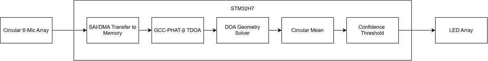
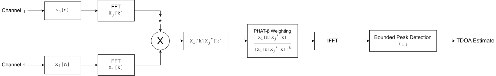
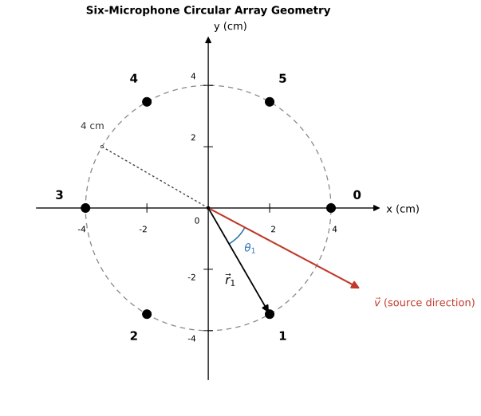
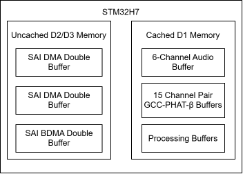

# Real-Time GCC-PHAT-&beta; Microphone Array

A real-time embedded direction-of-arrival (DOA) estimation system using a circular six-microphone array, GCC-PHAT-&beta; time-difference-of-arrival (TDOA) estimation, and a least-squares geometry solver running on an STM32H7.

## Demo

The system synchronously captures audio from six microphone channels at approximately 48 kHz, computes GCC-PHAT-&beta; cross-correlations for all 15 microphone pairs, and estimates the direction of arrival in real time.

## System Overview

## Hardware

The system uses a circular six-microphone array to synchronously capture audio and an STM32H7 development board to perform the real-time DSP pipeline and DOA estimation.

### Microphone Array

The [Sipeed 6+1 Microphone Array](https://www.dfrobot.com/product-1976.html) contains six MEMS microphones ([MSM261S4030H0](https://dfimg.dfrobot.com/wiki/19409/SEN0526_i2s-mems-microphone_datasheet_v1.0.pdf)) evenly spaced around a circle with a 4 cm radius, plus a seventh microphone at the center that is not used. The microphones communicate over I2S, with microphones 0 and 1, 2 and 3, and 4 and 5 sharing interfaces through time-division duplexing (TDD). The three interfaces use shared bit and word-select clocks, allowing the microphone channels to be sampled synchronously.

The board also contains 12 RGB LEDs ([SK9822](https://www.normandled.com/upload/201909/SK9822%20LED%20Datasheet.pdf)) arranged in a hexagon on the opposite side of the PCB from the microphones. The LEDs communicate over SPI and provide a real-time indication of the estimated DOA.

The microphone array was selected primarily because it provides six raw microphone channels with synchronized digital audio at low cost:

* **Low cost:** At $11.90 before shipping, the board was significantly less expensive than most microphone arrays considered for this project, which were typically more than $60.
* **Raw microphone outputs:** Many alternative microphone arrays include dedicated audio-processing ICs that perform functions such as beamforming or source localization. Using raw microphone outputs keeps the signal-processing pipeline under control of the STM32 and makes the implementation of the localization algorithm explicit.
* **Six microphones:** Six microphones provide $\binom{6}{2}=15$ unique microphone pairs, providing redundant TDOA measurements for the geometry solver.
* **Minimal processing:** The limited on-board processing keeps the focus of the project on implementing the audio acquisition and DSP pipeline on the microcontroller.

### STM32H7 Development Board

The [NUCLEO-H723ZG](https://www.st.com/en/evaluation-tools/nucleo-h723zg.html) was selected for the following reasons:

* **Compute performance:** The Cortex-M7 provides sufficient computational throughput for the FFTs, filtering, 15 GCC-PHAT-&beta; correlations, and geometry calculations required by the real-time pipeline.
* **SAI support:** The SAI peripherals allow the three I2S interfaces to share synchronized clocks internally, eliminating the need for external clock-routing hardware.
* **Single core:** A single-core processor reduces software complexity compared with a dual-core system while providing sufficient performance for this application.
* **Internal RAM:** The STM32H723 provides sufficient internal RAM for the audio and DSP buffers without requiring external memory.
* **Maturity:** The NUCLEO-H723ZG is an established development board with extensive documentation and community support, which simplified hardware and software debugging.
* **Low cost:** The board provides the required processing and peripheral capabilities at relatively low cost compared with competing development platforms.

## DSP Pipeline

### GCC-PHAT-&beta; TDOA Estimation

GCC-PHAT is a source-localization algorithm that estimates the time difference of arrival (TDOA) between microphone pairs using generalized cross-correlation (GCC) with phase-transform weighting. The phase transform normalizes the magnitude of the cross-power spectrum while retaining its phase information, which can improve TDOA estimation for broadband signals and in reverberant environments. However, PHAT weighting can reduce performance for narrowband signals, where retaining spectral magnitude information can be beneficial.

$$
G_{ij}(f) = X_i(f)X_j^*(f)
$$

$$
R_{ij}(\tau) =
\mathcal{F}^{-1}
\left(
\frac{G_{ij}(f)}
{|G_{ij}(f)|}
\right)
$$

$$
\hat{\tau}_{ij} =
\underset{\tau}{\arg\max}
R_{ij}(\tau)
$$

The paper ["Performance of phase transform for detecting sound sources with microphone arrays in reverberant and noisy environments"](https://doi.org/10.1016/j.sigpro.2007.01.013) introduces GCC-PHAT-&beta; as an interpolation between GCC and GCC-PHAT. The parameter &beta; controls the amount of spectral magnitude normalization. When &beta; is zero, the weighting reduces to GCC, while &beta; equal to one gives standard GCC-PHAT. Intermediate values provide a compromise between the broadband robustness of PHAT and the narrowband performance of unweighted GCC.

$$
G_{ij}(f) = X_i(f)X_j^*(f)
$$

$$
R_{ij}^{(\beta)}(\tau) =
\mathcal{F}^{-1}
\left(
\frac{G_{ij}(f)}
{|G_{ij}(f)|^\beta}
\right)
$$

$$
\hat{\tau}_{ij} =
\underset{\tau}{\arg\max}
R_{ij}^{(\beta)}(\tau)
$$

The algorithm is implemented using FFT-accelerated GCC in the frequency domain. For each microphone pair, the cross-power spectrum is computed by multiplying the FFT of one channel by the complex conjugate of the FFT of the other. GCC-PHAT-&beta; weighting is then applied, followed by an inverse FFT to obtain the generalized cross-correlation in the time domain. The correlation peak provides the estimated TDOA. With six microphones, this process is performed for all $\binom{6}{2}=15$ unique microphone pairs.

For each audio channel:

1. **Bandpass filter:** Each channel is filtered with stopbands at approximately $100\text{ Hz}$ and $3\text{ kHz}$. The lower cutoff attenuates low-frequency noise such as room rumble from ventilation systems. The upper cutoff limits the frequency range to reduce spatial aliasing. For a circular array with radius $r=4\text{ cm}$, the approximate spatial-aliasing frequency is
   $$
   f_{\text{alias}} \approx \frac{343\text{ m/s}}{2(0.04\text{ m})} \approx 4.3\text{ kHz}.
   $$
   The filter is implemented as a fourth-order IIR filter in second-order-section (SOS) form for computational efficiency and numerical stability. CMSIS-DSP coefficients are generated using the MATLAB script `generate_filter_coefs.m`.

2. **FFT:** The filtered signal is transformed into the frequency domain using an FFT.

For each pair of audio channels $i,j$:

3. **Cross-power spectrum:** Compute the elementwise product
   $$
   G_{ij}(f)=X_i(f)X_j^*(f),
   $$
   where $X_j^*(f)$ is the complex conjugate of the FFT of channel $j$. This produces the cross-power spectrum between the two channels.

4. **GCC-PHAT-&beta; weighting:** Apply the weighting
   $$
   \frac{G_{ij}(f)}{|G_{ij}(f)|^\beta}.
   $$
   When $\beta=1$, the magnitude is completely normalized, giving standard GCC-PHAT. When $\beta=0$, no magnitude normalization is applied, giving standard GCC. Values between 0 and 1 provide a continuous tradeoff between these two weighting schemes. A value of $\beta$ between 0.5 and 0.7 is recommended by the referenced work.

5. **Inverse FFT:** Transform the weighted cross-power spectrum back into the time domain to obtain the generalized cross-correlation.

6. **Peak detection:** Search for the correlation peak within the physically possible TDOA range determined by the microphone geometry. Sub-sample interpolation can then be applied around the peak to improve TDOA resolution beyond the native sampling interval.

### Least-Squares Geometry Solver

Once the TDOA estimates have been computed for all microphone pairs, a least-squares geometry solver estimates the direction of arrival.

For a far-field plane wave, the TDOA between microphones $i$ and $j$ is determined by the projection of their separation vector onto the unit propagation vector $\hat{u}$:

$$
(\vec{r}_j-\vec{r}_i)^T\hat{u}=c\tau_{ij},
$$

where $c=343\text{ m/s}$ is the assumed speed of sound.

Construct matrix $R$ from the microphone separation vectors and vector $\vec{\tau}$ from the corresponding TDOA estimates:

$$
R =
\begin{bmatrix}
(\vec{r}_2-\vec{r}_1)^T \\
(\vec{r}_3-\vec{r}_1)^T \\
\vdots \\
(\vec{r}_6-\vec{r}_5)^T
\end{bmatrix},
\qquad
\vec{\tau} =
\begin{bmatrix}
\tau_{12} \\
\tau_{13} \\
\vdots \\
\tau_{56}
\end{bmatrix}.
$$

The resulting system is

$$
R\hat{u}=c\vec{\tau}.
$$

The six microphones produce 15 pairwise TDOA measurements, while the two-dimensional propagation vector $\hat{u}$ contains only two unknown components. The system is therefore highly overdetermined, allowing the redundant TDOA measurements to be combined using least squares:

$$
R^TR\hat{u}=cR^T\vec{\tau}
$$

$$
\hat{u}=c(R^TR)^{-1}R^T\vec{\tau}.
$$

The matrix

$$
M=(R^TR)^{-1}R^T
$$

depends only on the fixed microphone geometry and can therefore be precomputed. The runtime calculation reduces to

$$
\hat{u}=cM\vec{\tau}.
$$

The matrix $M$ is generated using the MATLAB script `geometry_solver_matrix_generator.m`. Because the speed of sound only scales the magnitude of $\hat{u}$ and does not affect its direction, the factor $c$ can be omitted when computing the DOA angle.

Finally, the estimated direction is converted to an angle using

$$
\theta=\mathrm{atan2}(\hat{u}_y,\hat{u}_x)
$$

## Embedded Implementation

### Software Architecture

The DSP pipeline uses a double-buffered DMA architecture. While one half of each DMA buffer is being filled with new audio samples, the other half is processed by the CPU. This allows audio acquisition and DSP processing to proceed concurrently.

Interrupt callbacks are enabled for half-transfer and transfer-complete events on each of the three SAI/I2S DMA buffers. The main loop waits until all three interfaces have completed the corresponding half-buffer transfer before beginning DSP processing. This ensures that all six microphone channels are processed from the same time interval.

### Memory/DMA Architecture

The memory architecture is designed to allow DMA buffers to be accessed reliably while retaining the performance benefits of the STM32H7 data cache. DMA writes do not automatically invalidate corresponding cache lines, so CPU accesses to cached DMA buffers can return stale data unless the cache is explicitly managed.

  

To avoid this issue, the linker script places DMA and BDMA buffers in dedicated D2 and D3 RAM sections, respectively. Caching is disabled for these regions, while non-DMA buffers are placed in cached D1 RAM. This allows the audio buffers to remain coherent with DMA while DSP working buffers benefit from data-cache acceleration.

## Performance

Sample rate  
Block size  
Channels  
Pairwise correlations  
Latency  
Block duration  
CPU utilization  
RAM usage  
FLASH usage

## Validation

Talk about the 6 sample shift tests  
Talk about extracting STM32 memory, importing into MATLAB, and testing the algorithm on it

## Future Work

- Better fractional interpolation if necessary
- Test zeroing out unnecessary parts of spectrum with framing
- Try higher clock speed
- Dynamic &beta;
- Add real-time beamforming (need to figure out good way to get signal off of board onto computer or speaker)
- Mechanical enclosure
- Kalman/particle filter result rather than simple circular mean

## Repository Structure

## References